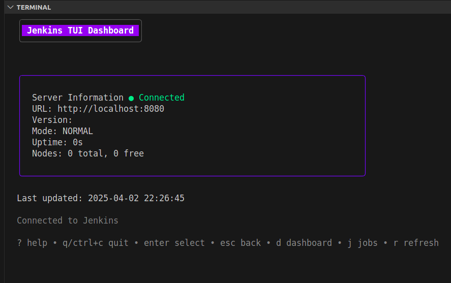
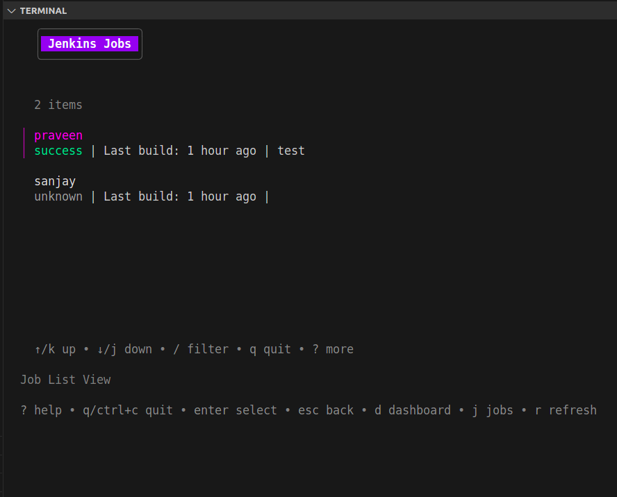
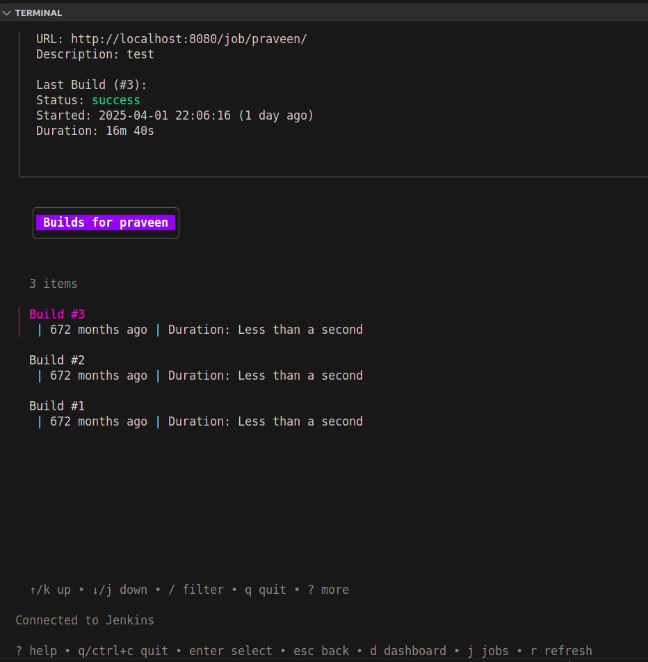
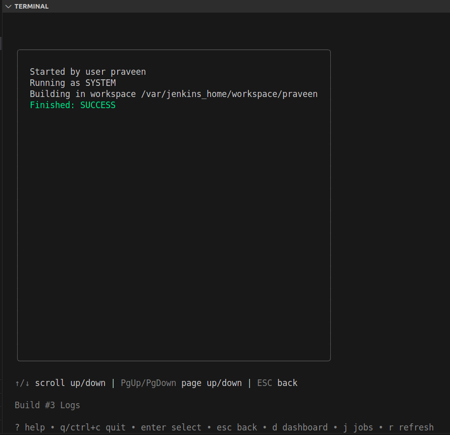

# Jenkins TUI

A terminal-based user interface for Jenkins, built with [Bubble Tea](https://github.com/charmbracelet/bubbletea)

## Features

- **Dashboard View**: Overview of server status and recent jobs
- **Job List**: Browse and filter all Jenkins jobs
- **Job Details**: View detailed information about jobs
- **Build Logs**: Stream and search build logs with automatic follow
- **Keyboard Navigation**: Easy and intuitive keyboard controls

## Installation

### Prerequisites

- Go 1.21 or higher
- A Jenkins server with API access

### Building from Source

```bash
# Clone the repository
git clone https://github.com/sanjaykishor/JenkinsTui.git
cd JenkinsTui

# Build the application
make build

# Run the application
./bin/jenkinsTui
```

### Configuration

Create a configuration file at `~/.jenkins-cli.yaml` with your Jenkins server details:

```yaml
current: default
jenkins_servers:
  - name: default
    url: https://jenkins.example.com
    username: admin
    token: your-api-token-here
    proxy: ""
    insecureSkipVerify: true
```

## Usage

### Keyboard Controls

- Global
  - `q`: Quit
  - `?`: Toggle help
  - `d`: Go to Dashboard
  - `j`: Go to Jobs list
  - `ESC`: Go back

- Job List
  - `↑/↓`: Navigate jobs
  - `Enter`: View job details
  - `/`: Search jobs

- Job Detail
  - `Enter`: View build logs
  - `b`: Trigger build

- Build Logs
  - `f`: Toggle follow mode
  - `/`: Search logs
  - `↑/↓`: Scroll logs

## Screenshots

### Dashboard View


### Job List View


### Job Detail View


### Build Logs View


## Development

### Project Structure

```
JenkinsTUI/
├── cmd/
│   └── jenkinsTui/           # Application entry point
├── configs/                  # Configuration files
├── internal/
│   ├── api/                  # Jenkins API client
│   ├── config/               # Configuration management
│   ├── tui/                  # Terminal UI components
│   └── utils/                # Utility functions
└── README.md                 # Project documentation
```

### Building & Testing

```bash
# Build the application
make build

# Install the application
make install

# Configure the .yaml file
make config
```

## Contributing

Contributions are welcome! Please feel free to submit a Pull Request.

## License

This project is licensed under the MIT License - see the LICENSE file for details.

## Acknowledgments

- [Bubble Tea](https://github.com/charmbracelet/bubbletea) for the terminal UI framework
- [Lip Gloss](https://github.com/charmbracelet/lipgloss) for terminal styling
